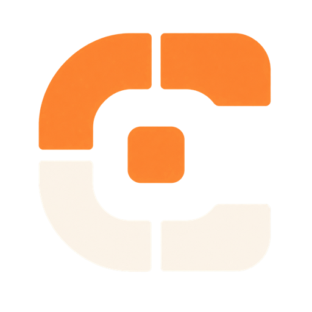

<div align="center">

<br />



# CoCanvas

**Your brief. Your board. Your agent.**

[](https://cocanvas-beta.vercel.app)
[](#run-from-source)
[](https://webmcp.devpost.com)
[](#license)

</div>

## What this is

CoCanvas is a product-flow canvas that stays in your browser. You write the job in a brief. You and an agent draw on the same board: boxes, arrows, pins. Nothing is uploaded. There is no account and no server.

The usual deal with "AI design" is the other way around. You describe a checkout in chat until the model invents a fifth step, or you export a PNG so it can squint at pixels and guess. I built this because "add payment between address and success, then connect them" is a terrible chat prompt and a one-second move on a board.

So the agent comes here. WebMCP tools run in the page, against the same zustand store the toolbar uses. Every change is tagged You or Agent. If the draft is a mess, undo the last turn. If it is close, drag the box yourself.

## Why WebMCP

A chat sidebar cannot point at a node. I checked. A remote MCP server cannot sit on the live board you are editing. A screenshot cannot pin "payment is missing" on the success step.

WebMCP is what lets the page hand the agent real tools on the exact document. The agent reads real ids and writes real geometry. `review_canvas` is page logic, not model vibes: missing brief terms, unlabeled shapes, orphans, no start or end, sibling side arrows, arrows on score bars, a hub stretched like a banner, overlaps. If the agent draws a typeset table of labels, the page calls that a failed board.

The fun part is you can lie to it on purpose. Click **Find the gap**. The page sets a grocery checkout, draws cart / address / success, and skips payment. Review finds the hole and pins it on Success. You add Payment with the mouse, connect it, export a PNG. That is the whole product in one cheat.

## What's in the app

- The board is the document. Frames, cards, ellipses, type, stickies, labeled arrows, pins. Not a chat with a preview pane.
- Write a brief first. `draft_from_brief` and `review_canvas` stay hidden until you do. That is the leash.
- You and the agent edit the same store. Shift-click, drag a box, or Ctrl/Cmd+A, then move or delete the group.
- One ChatGPT prompt (Astra from the source) and three short demos: skip payment, tighten a messy board, draw how this page works.
- Export a PNG from the rail, or let the agent call `export_png`. Same picture.
- Delete and clear ask first. Undo and redo sit in the header. Night paper stays if you picked it.

## Try it

No login. The board stays in this browser after a reload.

**Live:** [cocanvas-beta.vercel.app](https://cocanvas-beta.vercel.app)

1. Open the live URL. Write a brief, or leave it empty and let the agent set one.
2. Connect an agent:
   - **ChatGPT desktop (easiest).** Open the live URL in the **built-in browser**, not a Codex preview and not chatgpt.com in Chrome. Use **GPT-5.6 Sol** or **GPT-5.6 Terra**. Site tools are off on Luna and Light. The header should say **Connected**. The address bar should show **Site tools**.
   - **Chrome 149+.** Turn on `chrome://flags/#enable-webmcp-testing`, relaunch, then open the live URL.
3. Copy a job from the Agent panel or the **Not connected** guide:
   - **Astra from the source** (the prompt): open the OpenAI post, draw the one-pager, pin what is rolling out
   - **Find the gap** (demo): skip payment, let `review_canvas` find it. Or click **Find the gap** on the page.
   - **Tighten this board** (demo): critique what is already here
   - **How this page works** (demo): draw the product loop

4. Hate the draft? Undo. Almost right? Drag it. Done? Export a PNG.

### No WebMCP host?

The header stays **Not connected**. The in-page Agent panel still runs the same tools through a polyfill. Copy a prompt for later, or run **Draft from brief** / **Find the gap** on this page to see the tools move the board.

Open DevTools on the live URL. The page also installs `window.__cocanvasTools`:

```js
window.__cocanvasTools.list()
await window.__cocanvasTools.execute("get_canvas_summary", {})
await window.__cocanvasTools.execute("draft_from_brief", {})
```

That path uses the same store as a live agent: confirms, undo, and activity tagged Agent.

## How WebMCP is wired up

After the store loads, tools register on a native `document.modelContext` when the host has injected one, with fallbacks to `navigator.modelContext` and `window.modelContext`. If that arrives after first paint, registration retries. Definitions live in `src/webmcp/registerTools.ts`.

The page keeps a private polyfill for the Agent panel and `window.__cocanvasTools`. That polyfill does not occupy `document.modelContext`, so a host can still inject.

```ts
await document.modelContext.registerTool({
  name: "review_canvas",
  title: "Review the board against the brief",
  description: "Page-owned review of the live board against the brief.",
  inputSchema: { type: "object", properties: {}, additionalProperties: false },
  annotations: { readOnlyHint: true, untrustedContentHint: true },
  execute: () => {
    const report = reviewCanvas(store());
    return { content: [{ type: "text", text: JSON.stringify(report, null, 2) }] };
  },
});
```

The set changes with the board: `draft_from_brief` and `review_canvas` once a brief exists, `connect_elements` once there are two nodes, `undo_last` after a turn. Each tool has `name`, `description`, JSON Schema (`additionalProperties: false`), and `execute`. Read tools set `readOnlyHint: true`. User-authored text sets `untrustedContentHint: true`. Destructive tools wait for an in-page confirm.

One `AbortController` per tool, passed as `registerTool(..., { signal })`. When a tool leaves the gate, that controller aborts so the host drops it.

Execute handlers read or write the same zustand store as the UI. Agent calls are tagged `actor: "agent"`. A `draft_from_brief` pass is one undo.

### 25 tools

| Name | Type | What it does |
| --- | --- | --- |
| `get_brief` | read | The job written on the board. |
| `get_canvas_summary` | read | First look: brief, counts, pins, selection. |
| `list_elements` | read | Every node: id, geometry, labels. |
| `review_canvas` | read | Page-owned findings against the brief. |
| `list_pins` | read | Open and resolved critique pins. |
| `set_brief` | write | Write or replace the job. |
| `draft_from_brief` | write | Draft a connected flow from the brief. |
| `pin_element` | write | Pin a note on a real node. |
| `resolve_pin` | write | Mark a pin done. |
| `undo_last` | write | Revert the last turn. |
| `redo_last` | write | Restore the last undone turn. |
| `add_element` | write | Add a node. Caller ids are ignored. |
| `update_element` | write | Change text, size, or fill. |
| `move_element` | write | Place a node. |
| `delete_element` | write | Remove a node. Asks first. |
| `layer_element` | write | Bring forward or send back. |
| `duplicate_element` | write | Copy a node. |
| `align_element` | write | Align to the board or a neighbor. |
| `select_element` | ui | Point at a node so the human sees it. |
| `connect_elements` | write | Draw a labeled arrow. |
| `reverse_connector` | write | Flip an arrow. |
| `arrange_grid` | write | Snap nodes to a grid. |
| `set_background` | write | Change the paper. |
| `export_png` | read | Download a PNG of the live board. |
| `clear_canvas` | write | Empty the board. Asks first. |

## Run from source

```bash
git clone https://github.com/BlinkZ404/CoCanvas.git
cd CoCanvas
npm install
npm run dev
```

```bash
npm test
npm run test:e2e
npm run build
```

Vite, React, TypeScript, and zustand. Node 20+. Static. No extra services to stand up.

## Privacy

- The board is stored in `localStorage` under `cocanvas.board.v1`. The app never sends it to a server.
- Theme and auto-board keys stay in this tab too.
- Once you connect an agent, tool results can enter its context. Those calls are logged. Writes can be undone.
- No accounts, analytics, or telemetry.

## Project structure

```
src/
├── App.tsx                 # Keyboard, skip link, register tools
├── components/             # Board, inspector, toolbar, agent panel
├── store/canvasStore.ts    # Zustand document + undo
├── review/reviewCanvas.ts  # Page-owned brief review
├── exportBoard.ts          # PNG export
├── guide.ts                # Prompt library
├── layouts/draft.ts        # Brief-driven first sketch
├── geometry/               # Resize, extent, connectors
└── webmcp/
    ├── registerTools.ts    # native registerTool + DevTools hook
    └── polyfill.ts         # private page context; no document occupy
public/
├── logo.png
├── favicon.ico
├── favicon-16.png
├── favicon-32.png
├── apple-touch-icon.png
├── icon-192.png
├── icon-512.png
├── og.png                  # 16:9 social
└── devpost-cocanvas.png    # 3:2 gallery
vercel.json                 # Origin-Agent-Cluster + tools policy
LICENSE                     # MIT
```

## License

MIT. See [`LICENSE`](LICENSE). © 2026 Arifur Rahman.

Built for the [OpenAI WebMCP Challenge](https://webmcp.devpost.com).

[](https://github.com/BlinkZ404)
[](https://github.com/BlinkZ404/CoCanvas)
